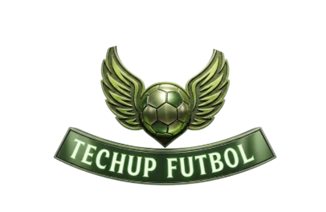

# TechCup - Frontend

## 👥 Participantes del proyecto
* Juan Diego Melo 
* Juan Esteban Rodriguez
* David Santiago Cajamara
* David Shadday Correa
* Jeimy Vanessa Torres

## 📝 Contexto del proyecto
Realizar una pagina web que permita gestionar todo lo relacionado con la organización del torneo semestral universitario que organiza el programa de Ingeniería de 
Sistemas para facilitar su planeación y desarrollo.

## 🎨 Logotipo

## 📖 Manual de identidad visual
[Manual de Identidad TECHCUP.pdf](recursos/Manual%20de%20Identidad%20TECHCUP.pdf)
## 🖼️ Mockups del sistema

https://www.figma.com/design/ntuQw9HDK5ni4791nbgedM/Tech?node-id=0-1&t=kr0Eo4dDKfF1WGFL-1

## 🧩 Módulos de la aplicación Web.

Link figma: https://www.figma.com/proto/ntuQw9HDK5ni4791nbgedM/Tech?node-id=1399-1482&p=f&t=252gzLxfSq1cz1lB-1&scaling=min-zoom&content-scaling=fixed&page-id=0%3A1&starting-point-node-id=1399%3A1482
