# Techup Fútbol — Documentación de Diseño UI/UX

---

## Tabla de contenido

1. [Descripción general](#descripción-general)
2. [Sprint 1 — Perfiles y vistas base](#sprint-1--perfiles-y-vistas-base)
3. [Sprint 2 — Invitación, búsqueda y login](#sprint-2--invitación-búsqueda-y-login)
4. [Sprint 3 — Mejoras, equipo, pago y torneo](#sprint-3--mejoras-equipo-pago-y-torneo)
5. [Resumen por sprint](#resumen-por-sprint)

---

## Descripción general

**Techup Fútbol** es una plataforma web de gestión de torneos universitarios de fútbol desarrollada para la **Escuela Colombiana de Ingeniería Julio Garavito**.

| | |
|---|---|
| **Paleta** | Verde oscuro `#00674F` + Amarillo `#FFBF00` |
| **Tipografía** | Montserrat (UI) |
| **Roles** | Jugador (Estudiante / Egresado / Familiar) · Árbitro · Admin |

---

---

# Sprint 1 — Perfiles y vistas base

> Diseñar las pantallas de perfil para cada rol de usuario y la vista del torneo activo.

---

## Flujo 1 — Jugador

> Landing → Login → Perfil del Jugador

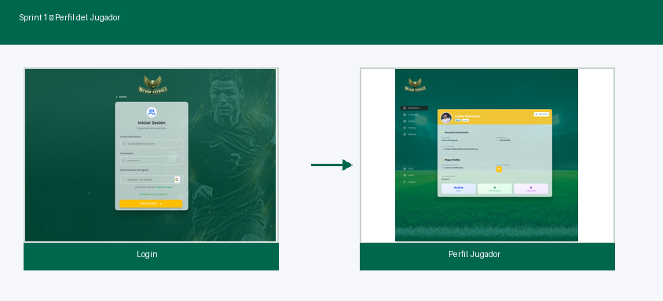

### Pantallas

#### Login

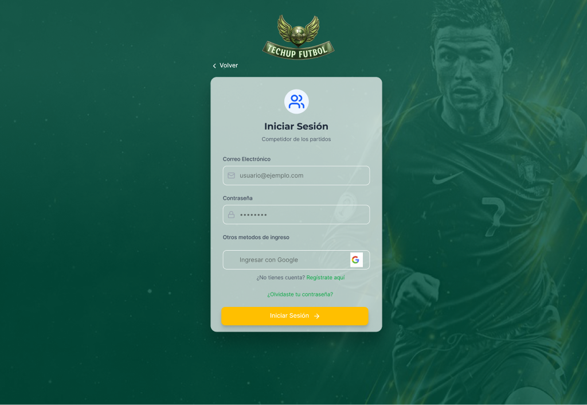

- Campos de correo y contraseña
- Botón **"Ingresar con Google"**
- Links: Regístrate / ¿Olvidaste tu contraseña?

---

#### Perfil del Jugador

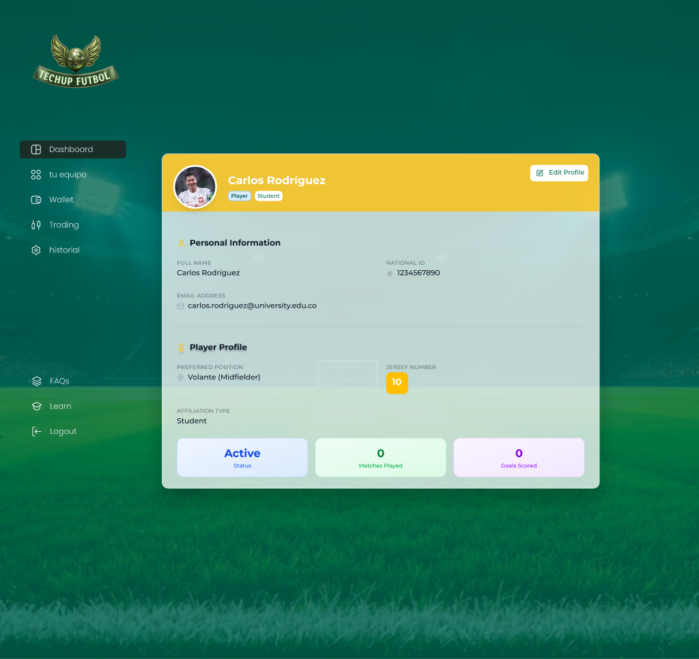

- Header amarillo con nombre, foto y badges **Player / Student**
- Información personal: nombre, cédula, correo
- Sección *Player Profile*: posición, número de camiseta (#10)
- Estadísticas: Status **Active** · Partidos · Goles

---

## Flujo 2 — Árbitro

> Login → Perfil Árbitro → Torneo Actual (tabla de posiciones)

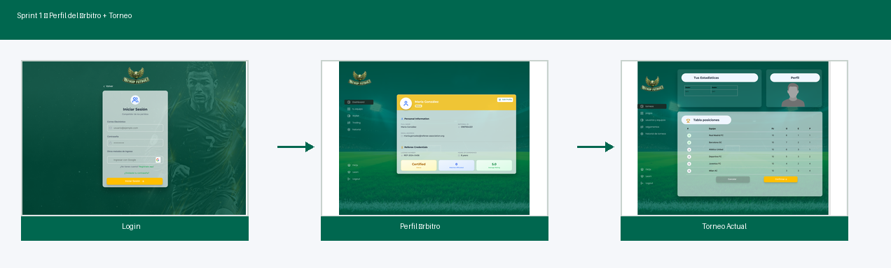

### Pantallas

#### Perfil del Árbitro

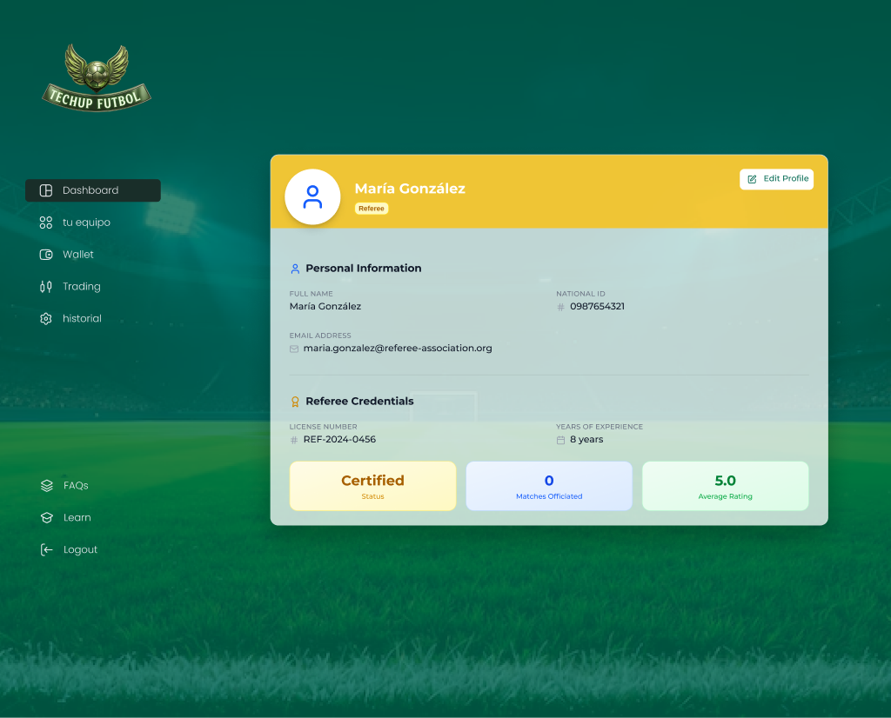

- Badge **Referee** en el header
- *Referee Credentials*: Licencia REF-2024-0456 · 8 años de experiencia
- Estadísticas: **Certified** · 0 partidos · 5.0 rating

---

#### Torneo Actual

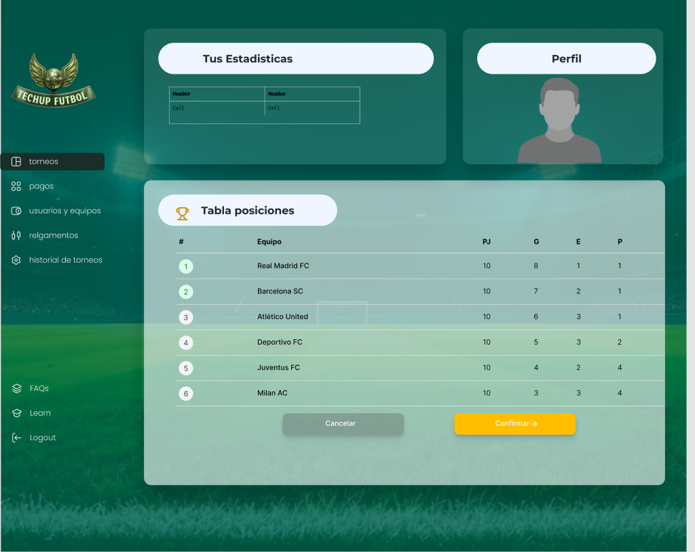

Vista principal del árbitro: tabla de posiciones del torneo en curso.

- Sidebar: Torneos, Pagos, Usuarios y Equipos, Reglamentos, Historial
- **Tabla de posiciones** con equipos, PJ, G, E, P
- Acciones: Cancelar / Confirmar →

---

## Flujo 3 — Administrador

> Login → Perfil Admin

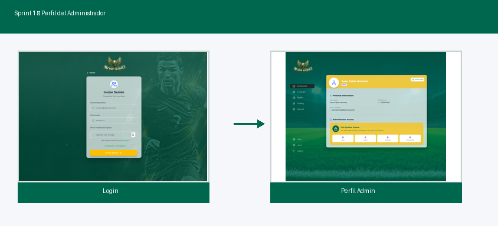

### Pantallas

#### Perfil del Administrador

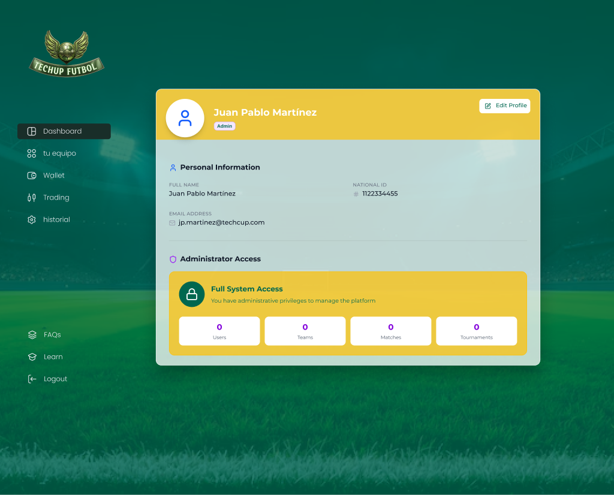

- Banner **"Full System Access"** — acceso total a la plataforma
- Estadísticas globales: Usuarios · Equipos · Partidos · Torneos

---

---

# Sprint 2 — Invitación, búsqueda y login

> Diseñar el punto de entrada, el flujo de búsqueda de jugadores, los pop-ups de login y los formularios de registro por tipo de afiliación.

---

## Flujo 4 — Login y acceso inicial

> Página Principal → Acceso → (si olvidó contraseña) → Recuperar Contraseña

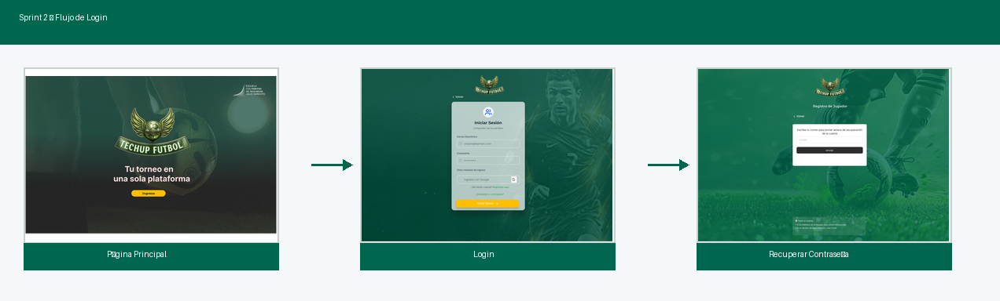

### Pantallas

#### Página Principal

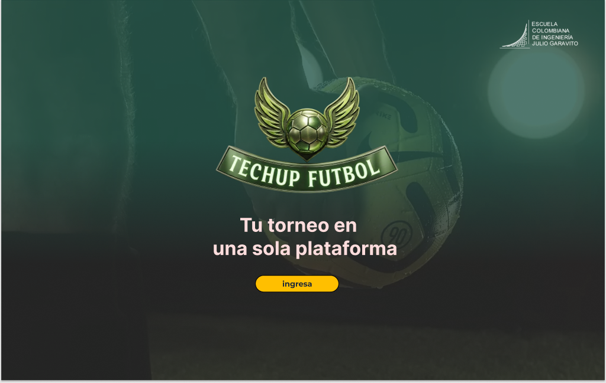

- Landing page de bienvenida
- Logo Techup Fútbol centrado
- Tagline: *"Tu torneo en una sola plataforma"*
- Botón amarillo: **"ingresa"**
- Logo ECIJ en esquina superior derecha

---

#### Acceso — Pantalla de Login

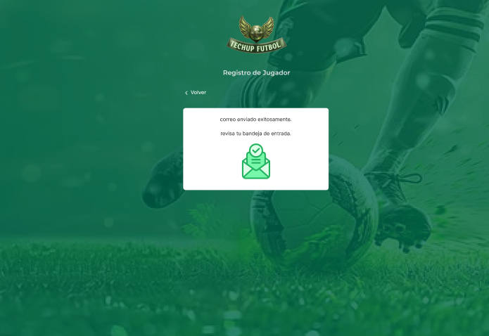

Modal de inicio de sesión que aparece sobre el fondo verde del campo. El diseño de Sprint 2 introduce este modal como puerta de entrada principal, previo a la redirección por rol.

---

#### Recuperar Contraseña

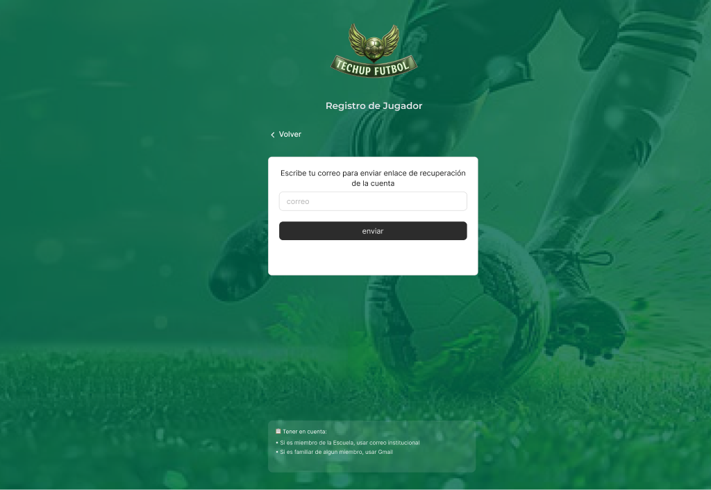

- Campo de correo para envío de enlace
- Instrucciones según tipo de usuario (institucional vs Gmail)

---

## Flujo 5 — Registro por tipo de afiliación

> Acceso → Registro → Selección de rol y afiliación (Student / Graduate / Family)

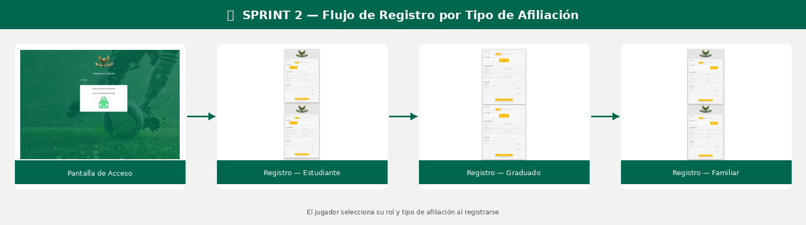

El formulario de registro adapta sus campos según el tipo de afiliación del jugador. Las tres variantes comparten la misma estructura base pero difieren en el campo de correo requerido.

### Pantallas

#### Registro — Estudiante (Student)

- Afiliación: **Student** (seleccionada con fondo amarillo)
- Correo debe ser institucional: `yourname@institution.edu`
- Campos: nombre completo, cédula, contraseña, posición preferida, número de camiseta, foto de perfil

---

#### Registro — Egresado (Graduate)

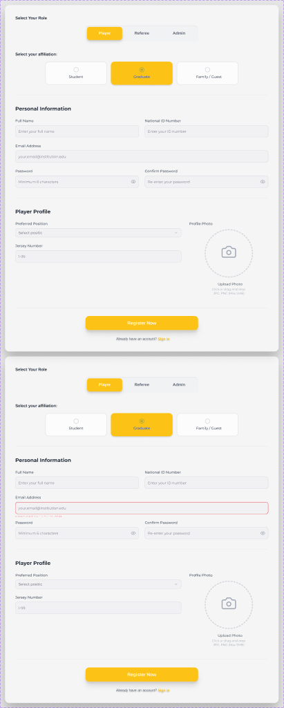

- Afiliación: **Graduate** (seleccionada)
- Correo requiere dominio de institución validado
- Campos idénticos al estudiante; diferencia en validación del correo

---

#### Registro — Familiar / Invitado (Family / Guest)

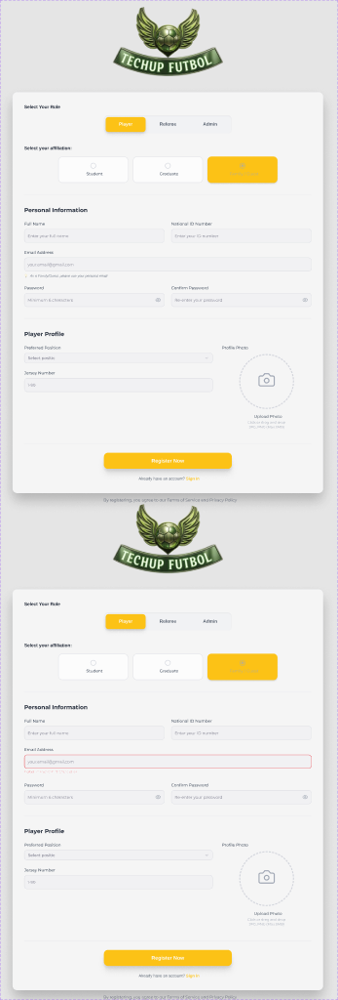

- Afiliación: **Family / Guest** (seleccionada)
- Correo libre (Gmail u otro)
- Se indica que el correo de un familiar los vincula a la cuenta del estudiante

---

## Flujo 6 — Búsqueda e invitación de jugadores

> Buscar Jugadores → Enviar invitación → Pop-up de confirmación / error / éxito

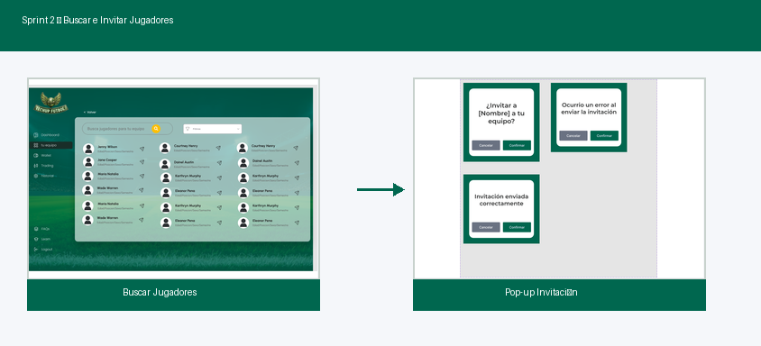

### Pantallas

#### Búsqueda de Jugadores (Sprint 2)

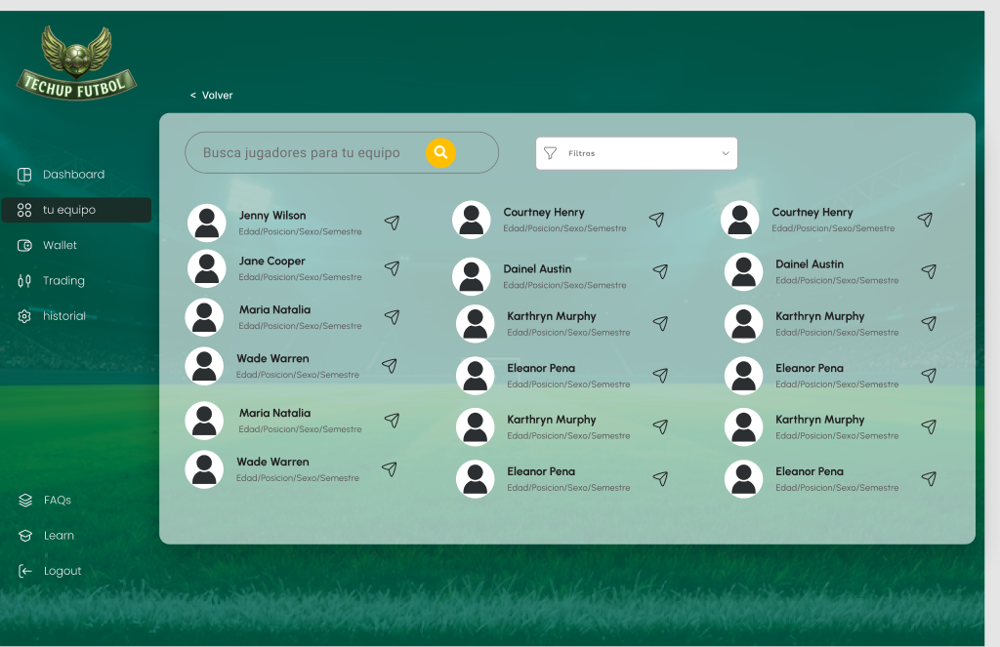

- Barra de búsqueda + botón de filtros
- Grid de tarjetas: foto, nombre, Edad / Posición / Sexo / Semestre
- Botón de invitar por jugador

---

#### Pop-up de Invitación — 3 estados (Sprint 2)

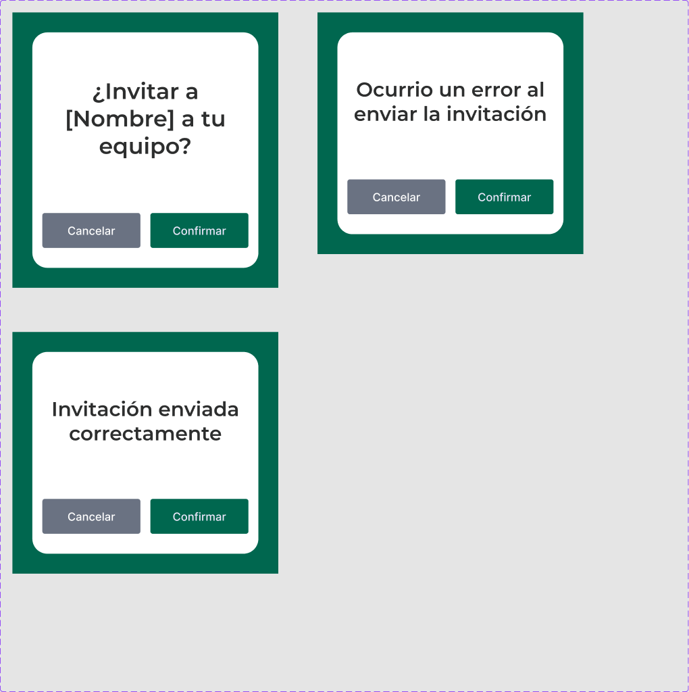

| Estado | Descripción |
|--------|-------------|
| Confirmación | *¿Invitar a [Nombre] a tu equipo?* |
| Error | *Ocurrió un error al enviar la invitación* |
| Éxito | *Invitación enviada correctamente* |

---

---

# Sprint 3 — Mejoras, equipo, pago y torneo

> Búsqueda con filtros avanzados, creación de equipo, **flujo de pago**, flujo del capitán, creación de torneo y mejora de pop-ups con flujos alternativos.

---

## Flujo 7 — Capitán: flujo completo (end-to-end)

> Sin Equipo → Crear Equipo → Buscar Jugadores → Invitar

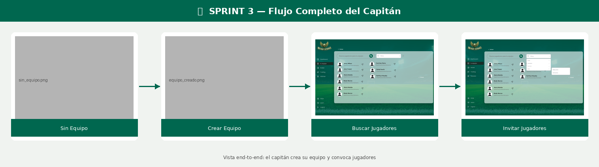

Vista macro del flujo del capitán desde que no tiene equipo hasta tener jugadores reclutados.

---

## Flujo 8 — Pago al crear equipo

> Sin Equipo → Formulario de Creación → **Formulario de Pago** → Confirmación Exitosa

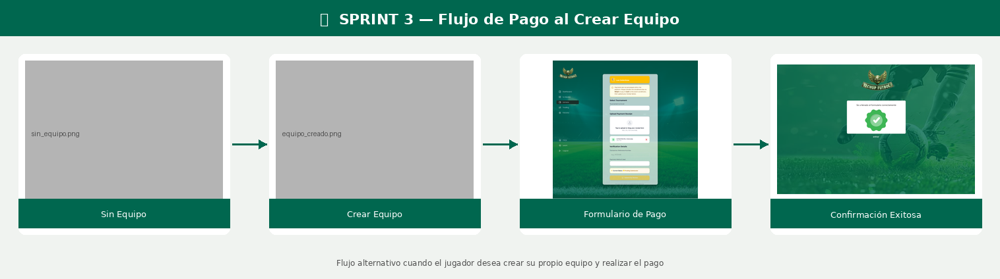

Este es el flujo alternativo que se activa cuando un jugador elige **"Convertirme en Capitán"** y procede a crear un equipo. El sistema requiere el pago de una cuota de inscripción antes de confirmar la creación del equipo.

### Pantallas

#### Sin Equipo / Convertirse en Capitán

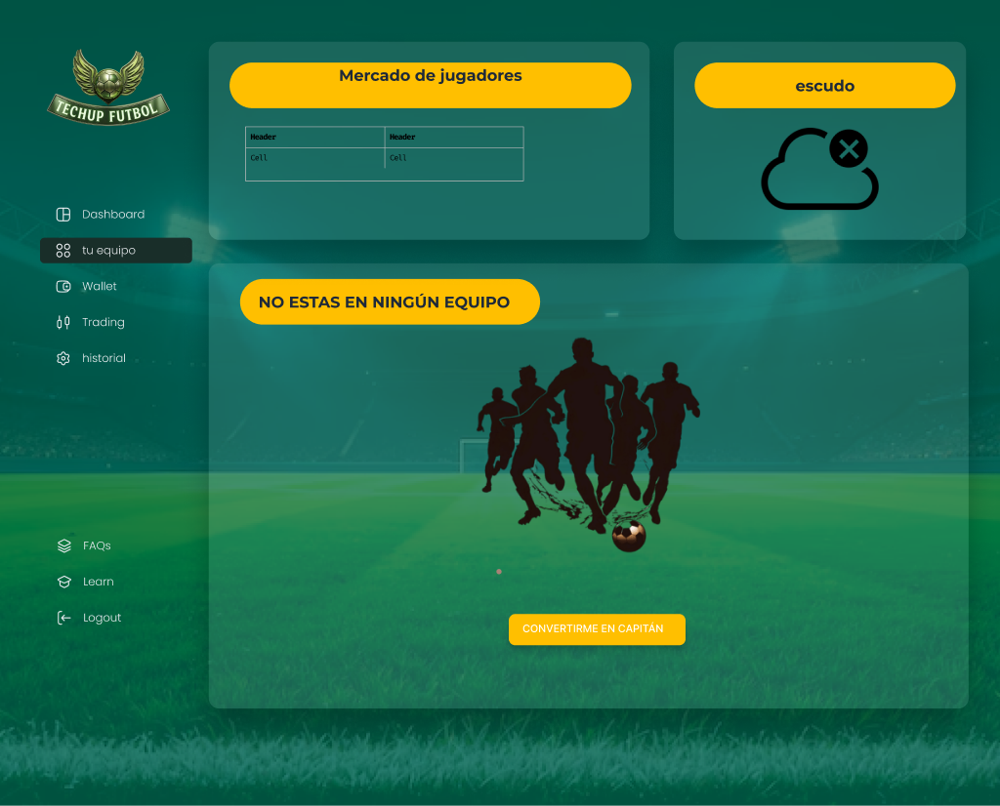

- Banner amarillo: **"NO ESTAS EN NINGÚN EQUIPO"**
- Ilustración de campo con siluetas
- Botón: **"CONVERTIRME EN CAPITÁN"**

---

#### Equipo Creado (configuración inicial)

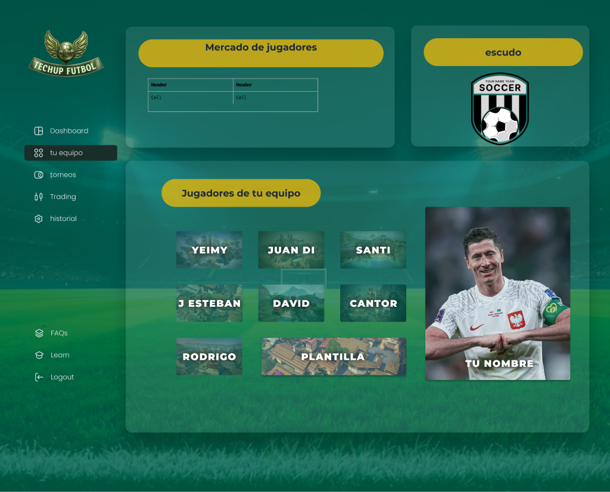

- Grid de jugadores reclutados: YEIMY, JUAN DI, SANTI, J ESTEBAN, DAVID, CANTOR, RODRIGO
- Escudo del equipo
- Panel de mercado de jugadores

---

#### Formulario de Pago al Crear Equipo

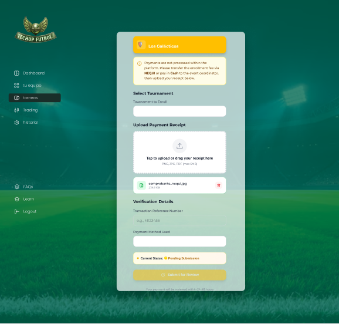

Panel de pago que aparece en el proceso de creación del equipo. Incluye:

- Detalles del costo de inscripción
- Campos de información de pago (método, referencia)
- Botón de confirmación para proceder

---

#### Confirmación Exitosa

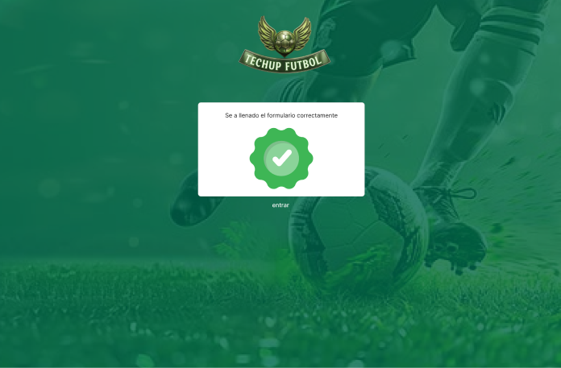

- Pantalla de éxito con fondo verde y logo de Techup Fútbol
- Ícono de verificación verde
- Confirma que el equipo fue creado y el pago procesado

---

## Flujo 9 — Búsqueda mejorada e invitación (Sprint 3)

> Resultados → Ver Perfil del Jugador → Confirmar Invitación → Estado del Pop-up

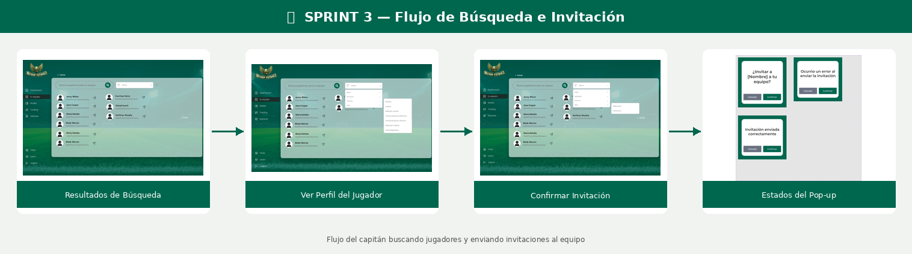

Evolución de la búsqueda del Sprint 2. Los resultados ahora muestran más información por jugador y el flujo de invitación incluye estados mejorados en los pop-ups.

### Pantallas

#### Búsqueda Mejorada — Resultados

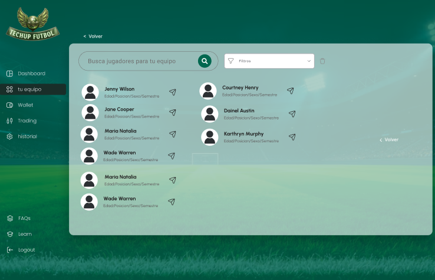

- Lista de jugadores con foto, nombre y datos
- Indicadores de disponibilidad por jugador
- Botones de acción por jugador

---

#### Búsqueda Mejorada — Con Filtros

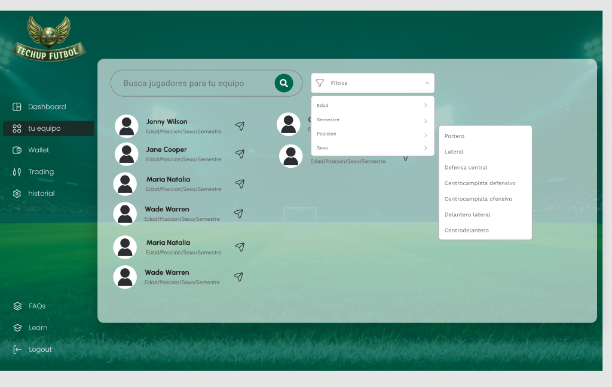

Mejora sobre la búsqueda del Sprint 2:

- Filtros expandidos: Edad · Semestre · Posición · Sexo
- Submenú de posición: Portero, Lateral, Defensa central, Centrocampista defensivo/ofensivo, Delantero lateral, Centrodelantero

---

#### Búsqueda Filtrada (filtro activo)

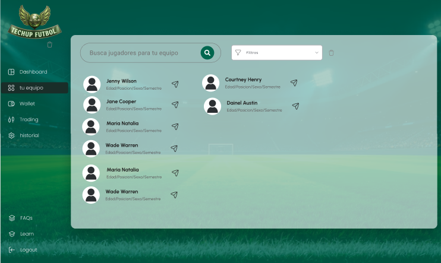

Vista de la búsqueda cuando un filtro específico ya está aplicado, mostrando el conjunto reducido de jugadores que cumplen el criterio.

---

#### Pop-up — Ver Perfil del Jugador

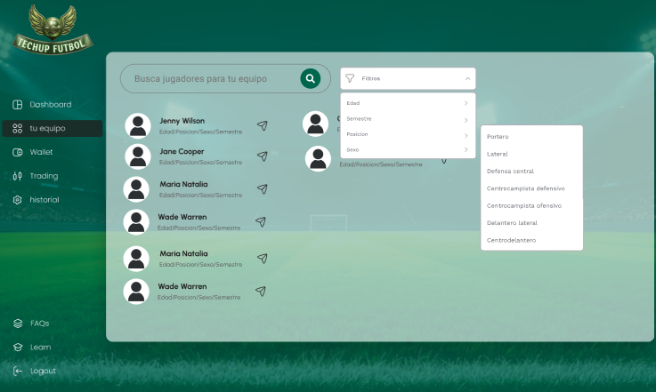

Tarjeta emergente al hacer clic en un jugador desde la búsqueda: muestra foto, nombre, estadísticas y botón para invitar.

---

#### Pop-up — Invitación Confirmada

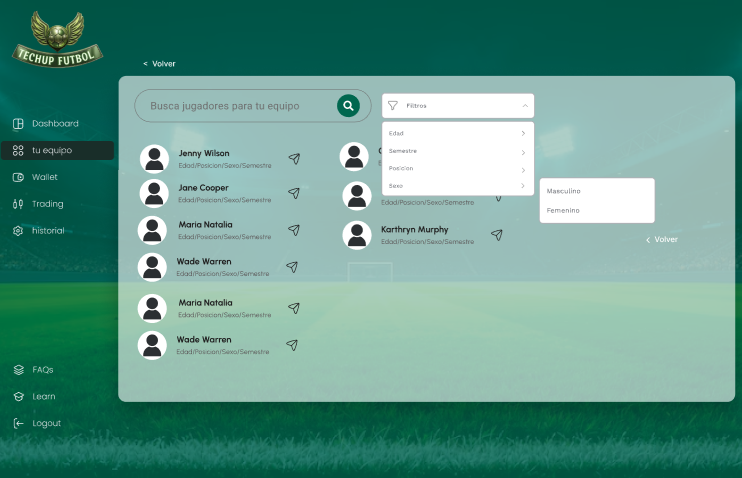

Estado del pop-up después de enviar la invitación. Muestra confirmación al capitán de que la solicitud fue enviada al jugador.

---

#### Pop-up — Estados de Invitación (Sprint 3 mejorado)

Los tres estados del pop-up de invitación rediseñados en Sprint 3:

| Estado | Texto | Acciones |
|--------|-------|----------|
| Confirmar | *¿Invitar a [Nombre] a tu equipo?* | Cancelar · Confirmar |
| Error | *Ocurrió un error al enviar la invitación* | Cancelar · Confirmar |
| Éxito | *Invitación enviada correctamente* | Cancelar · Confirmar |

---

#### Pop-up — Formulario de Invitación

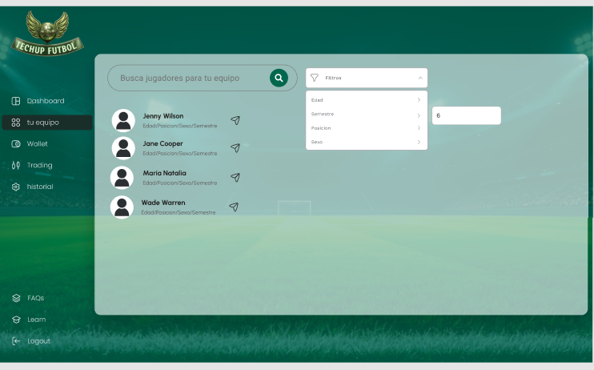

Variante del pop-up de invitación que incluye un pequeño formulario o mensaje personalizado para el jugador invitado.

---

## Flujo 10 — Búsqueda: flujo alternativo (sin resultados)

> Búsqueda → Filtro aplicado → Sin resultados (OOPS)

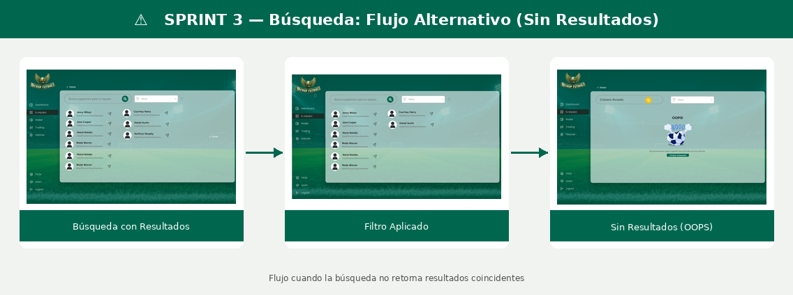

Flujo de error/vacío en la búsqueda de jugadores. Cuando los filtros aplicados son muy restrictivos o el nombre no existe en el sistema, se muestra la pantalla de "OOPS".

### Pantalla

#### Búsqueda Sin Resultados

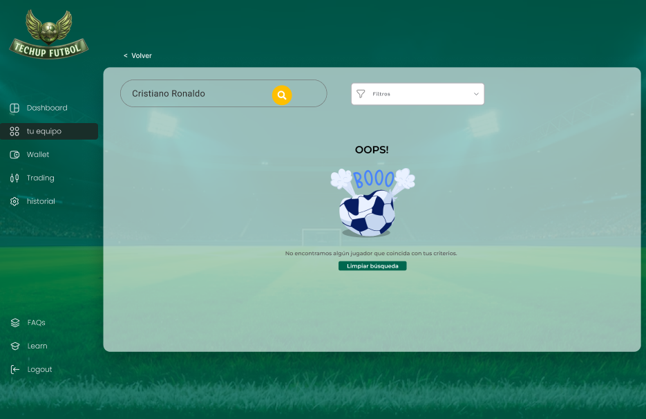

- Pantalla de estado vacío con ilustración y texto **"OOPS"**
- Mensaje indicando que no se encontraron jugadores para los criterios ingresados
- Invita al usuario a modificar los filtros o el término de búsqueda

---

#### Búsqueda con Pocos Resultados

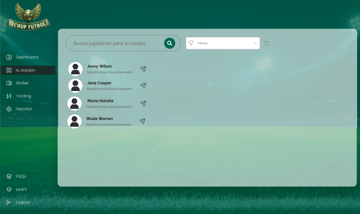

Estado intermedio: el sistema encontró una cantidad reducida de jugadores (3 en el ejemplo) que coinciden con el criterio, antes de llegar al estado de sin resultados.

---

## Flujo 11 — Registro de usuario (Sprint 3)

> Página Principal → Formulario de Registro completo

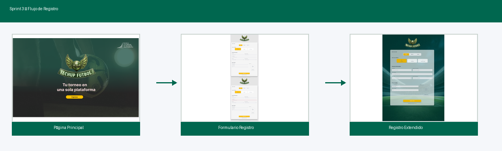

### Pantallas

#### Formulario de Registro

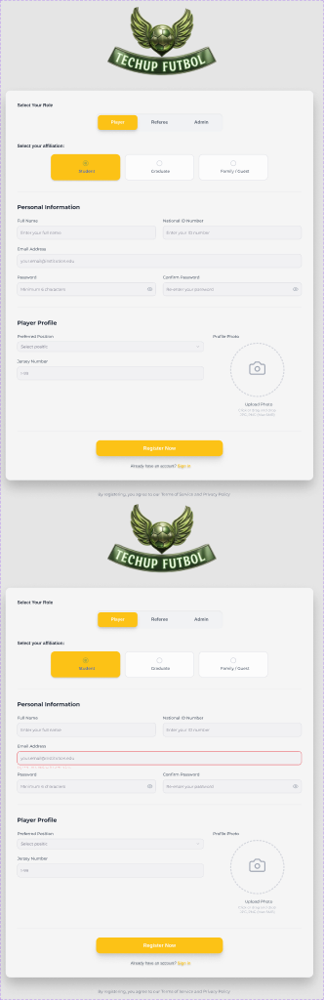

- Selector de **Rol**: Player · Referee · Admin
- Selector de **Afiliación**: Student · Graduate · Family/Guest
- Datos personales: nombre, cédula, correo, contraseña
- *Player Profile*: posición, número de camiseta, foto
- Botón **"Register Now"**

---

#### Registro Extendido

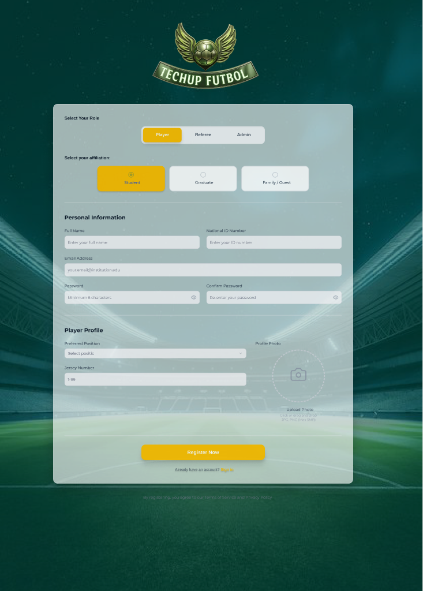

Vista ampliada mostrando todos los campos y estados de validación del formulario de registro.

---

## Flujo 12 — Creación de torneo (Admin)

> Configuración → Selección de duración → Fechas → Cierre de inscripciones

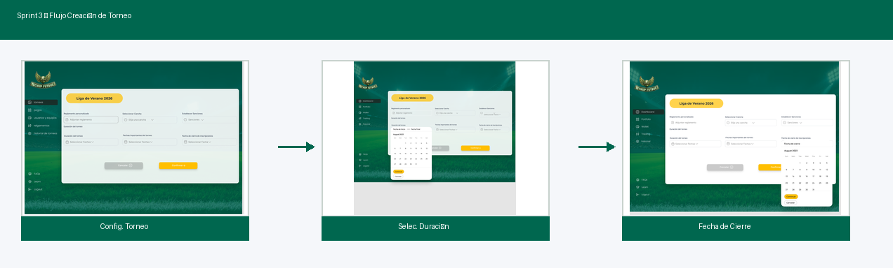

### Pantallas

#### Configuración del Torneo

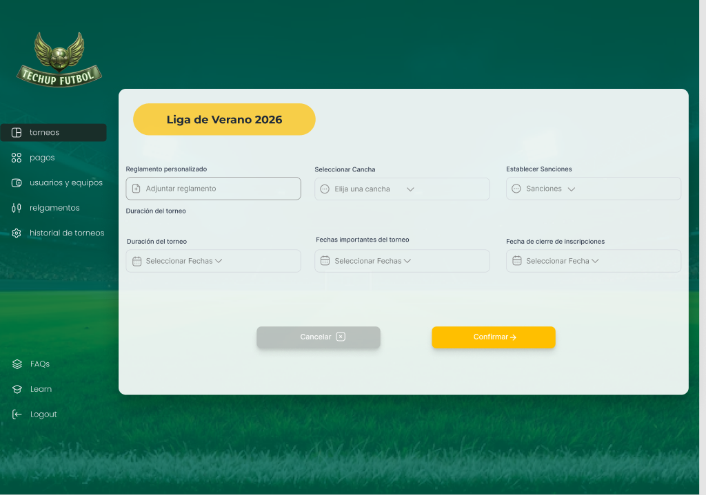

Formulario principal de creación. Nombre del torneo activo: **"Liga de Verano 2026"**

- Adjuntar reglamento personalizado
- Seleccionar cancha
- Establecer sanciones
- Campos de fecha: Duración · Fechas importantes · Cierre de inscripciones

---

#### Selector de Duración (Calendar)

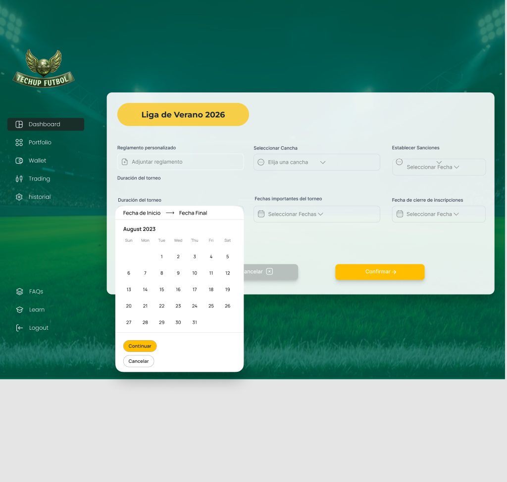

- Calendar picker con rango de fechas: **Fecha de Inicio → Fecha Final**
- Mes visible: August 2023
- Botones: Continuar / Cancelar

---

#### Cierre de Inscripciones

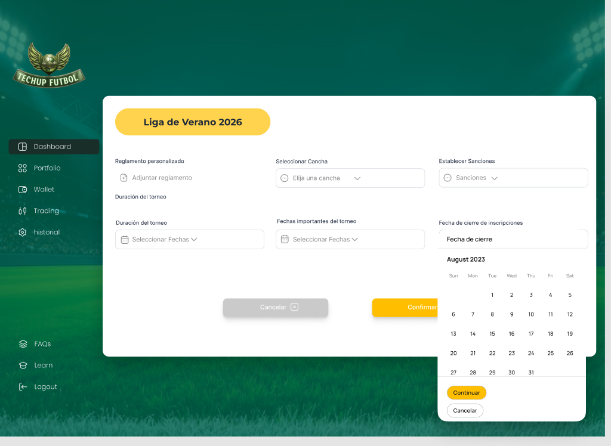

- Calendar picker para la **Fecha de cierre de inscripciones**
- Mismo mes de referencia (August 2023)
- Botones: Continuar / Cancelar

---

---

## Resumen por sprint

| Sprint       | #  | Flujo | Pantallas clave |
|--------------|----|-------|-----------------|
| **Sprint 1** | 1  | Jugador | Login, Perfil Jugador |
| **Sprint 1** | 2  | Árbitro | Perfil Árbitro, Torneo Actual |
| **Sprint 1** | 3  | Admin | Perfil Admin |
| **Sprint 1** | 4  | **Pago al crear equipo** | Sin Equipo, Pago, Confirmación Exitosa |
| **Sprint 2** | 5  | Login y acceso | Página Principal, Login Acceso, Recuperar Contraseña |
| **Sprint 2** | 6  | Registro afiliación | Registro Estudiante, Egresado, Familiar |
| **Sprint 2** | 7  | Búsqueda e invitación | Búsqueda Jugadores, Pop-up 3 estados |
| **Sprint 3** | 8  | Capitán — end-to-end | Sin Equipo → Buscar → Invitar |
| **Sprint 3** | 9  | Búsqueda mejorada | Resultados, Filtros, Perfiles, Pop-ups |
| **Sprint 3** | 10 | Búsqueda alternativa | Sin Resultados (OOPS), Pocos Resultados |
| **Sprint 3** | 11 | Registro completo | Formulario, Registro Extendido |
| **Sprint 3** | 12 | Creación de torneo | Config, Calendar, Cierre Inscripciones |

---
